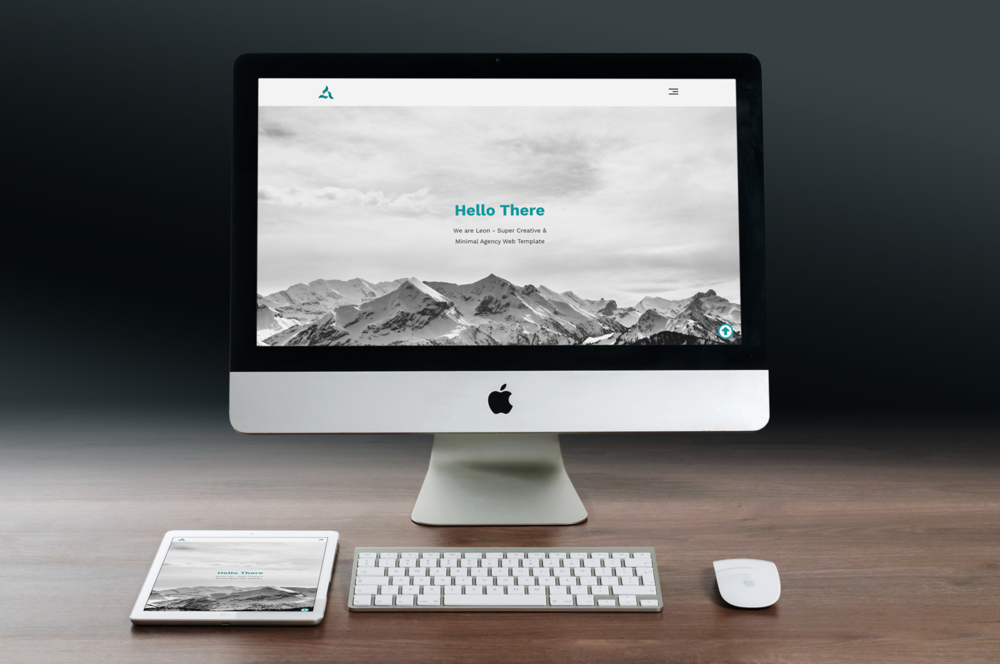

# Template One

## Table of Contents
- [Introduction](#introduction)
- [Features](#features)
- [Sample](#sample)
- [Usage](#usage)
- [Contributing](#contributing)
- [License](#license)
- [Contact](#contact)

## Introduction

Template One is a HTML and CSS design project aimed at providing a clean and modern template for web development.

**Demo:** [View Demo](https://bodaa004.github.io/Leon-Template/)

## Features

- **Responsive Design**: Adapts to different screen sizes.
- **Custom Fonts**: Uses webfonts for enhanced typography.
- **Modern Layout**: Utilizes flexbox for flexible and efficient layout structures.

## Sample

Here is a screenshot of the template:

## Usage

Open the `index.html` file in your web browser to view the template. Customize the HTML and CSS files as needed for your project.

## Contributing

We welcome contributions from the community!

1. Fork the repository.
2. Create a new branch (`git checkout -b feature-branch`).
3. Make your changes.
4. Commit your changes (`git commit -m 'Add new feature'`).
5. Push to the branch (`git push origin feature-branch`).
6. Open a pull request.

## License

This project is licensed under the MIT License. See the [LICENSE](LICENSE) file for more details.

## Contact

For any questions or support, please contact:
- **GitHub**: [Bodaa004](https://github.com/Bodaa004)
